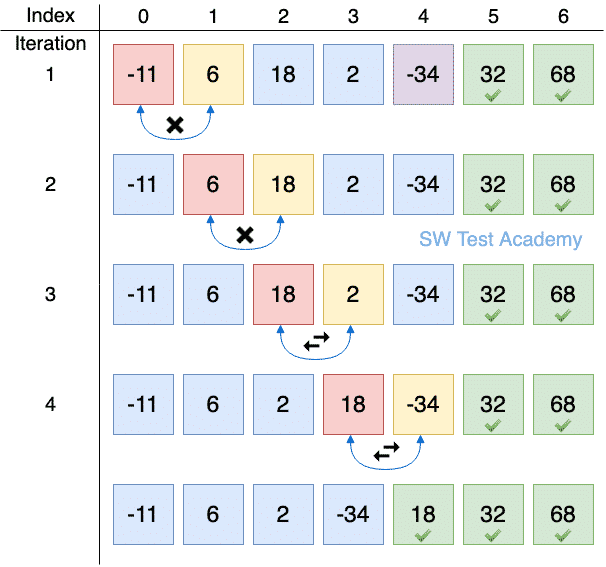

# Sorting

Sorting means arranging elements in a specific order, typically in increasing or decreasing order. There are many sorting techniques used to organize elements in an array.

# Bubble Sort

Bubble Sort is one of the simplest sorting algorithms. It's easy to understand and explain.

## Approach: Increasing Order

The basic idea is to repeatedly compare adjacent elements in the array and swap them if they are in the wrong order—specifically, if the left element is larger than the right one. This way, larger elements "bubble" toward the end of the array.

- We repeat this process for all elements, but we can optimize it:

- After each full pass through the array, the largest unsorted element will be in its correct position.

- Therefore, we can reduce the number of comparisons in subsequent passes.

- Additionally, we can check if any swaps occurred during a pass.

- If no swaps happen, it means the array is already sorted, and we can terminate early.

- This makes the algorithm more efficient in cases where the array is already sorted or nearly sorted.

## 👉 [Bubble sort implementation code](./bubbleSort.js)

## 👇 Disadvantages : Time complexity

- It is not suitable for large sized data.
- In average case and worst case time complexity is O(n2)

 

# Insertion Sort

Insertion Sort is a simple sorting algorithm that works by inserting each element into its correct position in a sorted portion of the array.

## Concept

The array is conceptually divided into two parts:

1.  A sorted portion (initially containing only the first element).

2.  An unsorted portion (the rest of the array).

- Starting from the second element, each item from the unsorted portion is compared with elements in the sorted portion.

- It is then inserted into its correct position by shifting larger elements to the right.

- This process continues until the entire array is sorted.

## Key points

- The first element is always considered sorted.

- For each element in the unsorted part:

- Compare it with the elements in the sorted part, moving from right to left.

- Shift elements to the right if they are larger than the current element.

- Insert the current element at the correct position.

- This results in the array being built up in a sorted manner, one element at a time.

## 👉 [Insertional sort Implementation code](./insertionalSort.js)

## 👇 Disadvantage : Time complexity

- In best case : when list is sorted already O(n)
- like bubble sort it has also O(n2) time complexity in average and worst case.

# Selection sort

Selection Sort is a simple comparison-based sorting algorithm. It divides the array into two parts:

A sorted subarray (initially empty).

- An unsorted subarray (initially the entire array).

- Principle
  The core idea of selection sort is:

##### Find the minimum element in the unsorted portion of the array. Swap it with the first element of the unsorted portion (which becomes part of the sorted subarray).

Repeat this process until the entire array is sorted.

### Process

In each pass, the smallest element from the unsorted subarray is selected and moved to the correct position in the sorted subarray.

A total of n - 1 passes are required for an array of size n, since the last element will naturally be in place after sorting all others.

## [Selection sort implementatin of code](./selectionSort.js)

# 🔍 Merge Sort — Divide and Merge Principle

Merge Sort is a classic divide and conquer algorithm. It works by dividing the array into smaller parts until each part contains only a single element (which is trivially sorted), and then merging these parts back together in a sorted manner.

## 🔁 Two Main Functions in Merge Sort

mergeSort – Recursive Division Function

- This function is responsible for recursively dividing the array.

- It doesn't actually split the array into new arrays, but instead uses indices (l and r) to logically divide it.

- It keeps breaking the array down until the base case is reached: a single element (l >= r), which cannot be divided further.

- merge – Merge and Sort Function

- Once the array is broken down into individual elements, this function is used to merge two sorted halves back together in the correct order.

- It creates a temporary array and picks the smaller elements from the left and right parts one by one, ensuring a sorted result.

## A visual view

## ✅ [link of merge sort implementation](./mergeSort.js)
